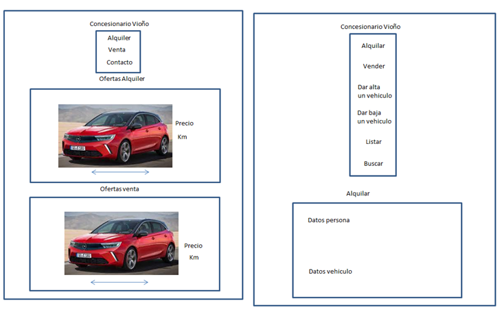
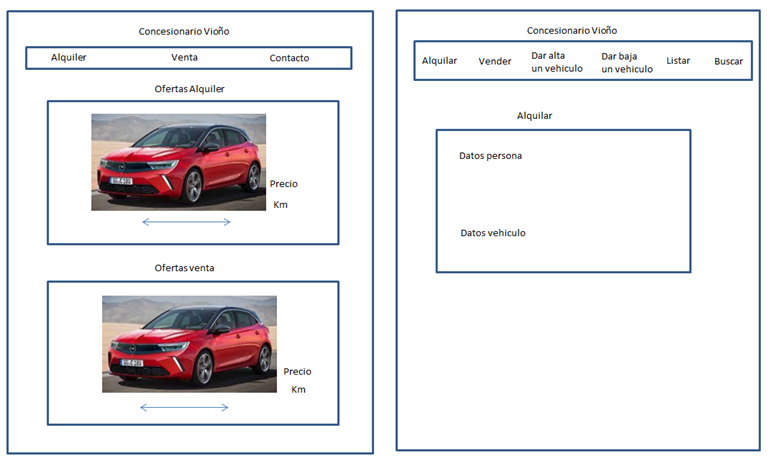

Presentación
Para presentar tu propuesta proporciona la siguiente información
1.	Título
○	Concesionario para venta y alquiler de vehículos
2.	Descripción
○	Aplicación que muestre a los clientes listado de vehículos disponibles para compra o alquiler y los que estén de oferta. Además estará conectado a una base de datos  para que el personal del concesionario tenga un registro de los datos de los coches, datos de persona que tiene alquilado el coche, etc.
3.	Necesidad que soluciona
○	Personas que quieran alquilar/comprar sin visitar el concesionario y gestión de vehículos por parte del concesionario.
4.	Destinatarios
○	Posibles clientes y concesionarios.
5.	Mockups
○	Vista de móvil (mobile first):

Vista movil:                                                                            

Vista escritorio: 

6.	MVP - Producto mínimo viable.
El cliente es capaz de ver todos los vehículos disponibles para alquilar y comprar desplegando las listas y en el menú principal habrá 2 sliders con fotos de los vehículos en ofertas.
El concesionario es capaz de gestionar la base de datos dar de alta y baja a vehículos, listarlos, buscarlos, etc.

